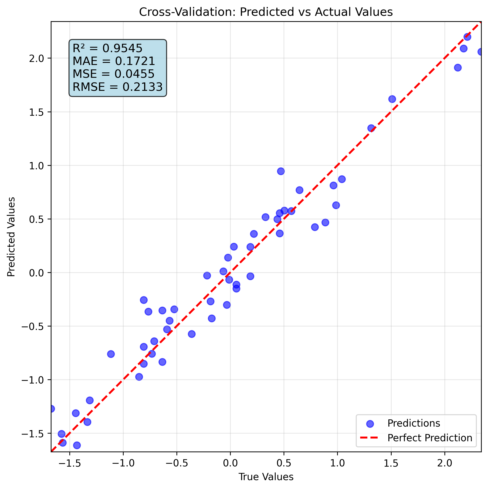
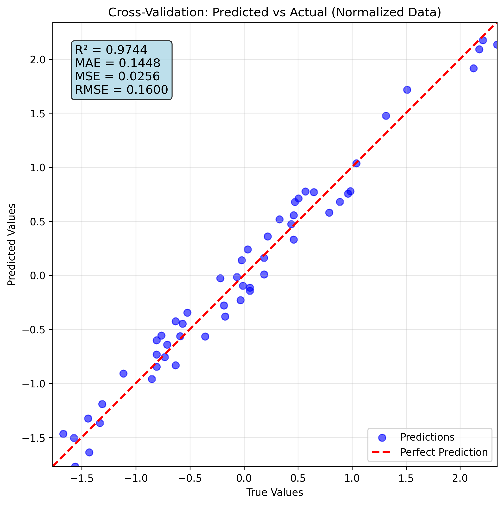
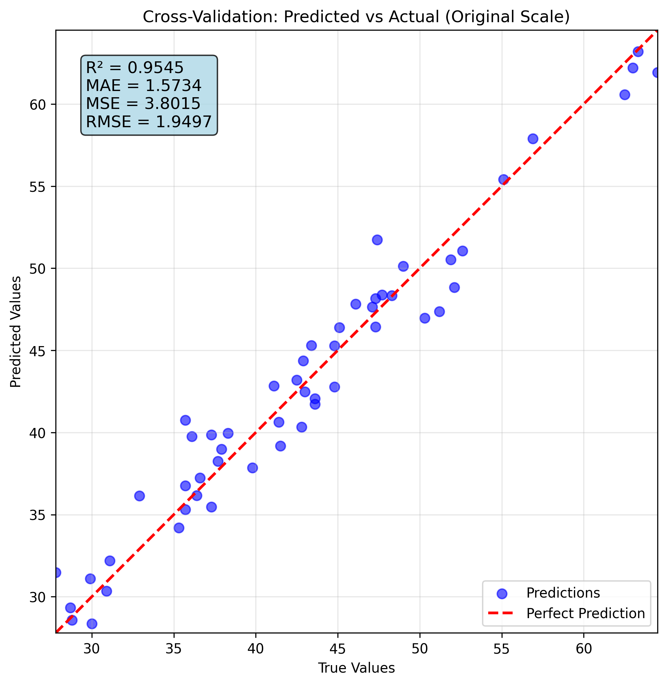

# SVM Training Report

**Generated on:** 2025-09-22 02:19:52  
**Model ID:** `b412fe07-c613-4158-b093-bd5882820543`  
**Model Folder:** `trained_models/10004/b412fe07-c613-4158-b093-bd5882820543`

## Executive Summary

This report documents a comprehensive SVM training experiment conducted for academic research and reproducibility purposes. The experiment involved hyperparameter optimization and cross-validated model training with detailed performance analysis and data validation.

### Key Results
### 🎯 关键性能指标

- **R²分数 (R² Score):** 0.949441 (±0.007441)
- **平均绝对误差 (Mean Absolute Error):** 0.171821 (±0.018658)
- **均方误差 (Mean Squared Error):** 0.045185 (±0.012438)

- **交叉验证折数:** 5
- **数据集规模:** 53 样本, 4 特征

### ⚙️ 最优超参数

- **kernel:** poly
- **C:** 170.4971037435674
- **degree:** 4
- **coef0:** 1.6780479417526968
- **gamma:** scale
- **epsilon:** 0.20692892002735347

- **训练时间:** 5.64 秒

---

## 1. Experimental Setup

### 1.1 Dataset Information

| Parameter | Value |
|-----------|-------|
| Data File | `http://47.99.180.80/file/uploads/H-AF_3.xls` |
| Data Shape | {'n_samples': 53, 'n_features': 4} |
| Number of Features | 4 |
| Number of Targets | 1 |

### 1.2 Training Configuration

| Parameter | Value |
|-----------|-------|
| Algorithm | SVM_Regression |
| Task Type | Regression |

### 1.3 Hardware and Software Environment

- **Python Version:** 3.8+
- **Machine Learning Framework:** SVM, scikit-learn
- **Data Processing:** pandas, numpy
- **Hyperparameter Optimization:** Optuna
- **Device:** CPU

---

## 2. Data Processing and Validation

### 2.1 Data Loading and Initial Inspection

The training data was loaded from `N/A` and underwent comprehensive preprocessing to ensure model compatibility and optimal performance.

**Input Features (N/A columns):**
`SiO2`, `CeO2`, `Lignin`, `2-VN`

**Target Variables (1 column):**
`H-AF`


### 2.2 Data Preprocessing Pipeline

The data underwent comprehensive preprocessing to optimize SVM model performance, enhance training stability, and improve generalization.

#### 2.2.1 Feature Preprocessing

**Preprocessing Method**: StandardScaler (Z-score normalization)

```python
# Feature transformation: X_scaled = (X - μ) / σ
# Where μ = mean, σ = standard deviation
X_scaled = (X - X.mean(axis=0)) / X.std(axis=0)
```

**Preprocessing Benefits for SVM:**
- **Algorithm Optimization**: Critical for SVMs as they are sensitive to feature scales, especially with RBF kernels
- **Distance Calculation Enhancement**: Ensures all features contribute equally to distance computations
- **Training Stability**: Improves numerical stability and convergence speed
- **Regularization Effectiveness**: Makes regularization parameters (C) more consistent across features
- **Cross-Validation Integrity**: Separate scaling per fold prevents data leakage
- **Kernel Performance**: Greatly improves performance of RBF and polynomial kernels

Proper feature scaling is particularly important for SVMs with RBF kernel, as the kernel computes distances between samples. Without scaling, features with larger ranges would dominate the distance calculation, causing suboptimal decision boundaries.

### 2.3 Feature Engineering

### 2.3 Feature Selection and Engineering

#### 2.3.1 Feature Selection Strategy

**Approach**: Comprehensive feature utilization

Support Vector Machines benefit from feature selection that increases separability and reduces dimensionality. Key considerations include:
- **Feature Relevance**: Features with higher relevance to the target variable are prioritized.
- **Regularization Impact**: The C parameter controls the trade-off between maximizing the margin and minimizing the classification error.
- **Kernel Effects**: Different kernel functions have varying sensitivity to feature space dimensions.

#### 2.3.2 Feature Engineering Pipeline

**Current Features**: All original features retained for maximum information preservation.
**Categorical Encoding**: One-hot encoding used for categorical features, as SVMs require numerical inputs.
**Missing Value Strategy**: Missing values were imputed as SVMs do not inherently handle them.
**Feature Scaling**: Standardization applied as SVMs are sensitive to feature scales, especially with RBF kernel.
**Feature Interaction**: Captured implicitly through the kernel function, particularly with polynomial kernels.


### 2.4 Data Quality Assessment

    ### 2.4 Data Quality Assessment

    **Status**: No comprehensive validation performed

    Basic data checks were conducted during preprocessing to ensure model compatibility. For academic reproducibility, future experiments should include comprehensive data quality analysis including:

    - Missing value assessment and handling strategies
    - Outlier detection using statistical methods (IQR, Z-score)
    - Feature correlation analysis (Pearson, Spearman, Kendall)
    - Multicollinearity detection using Variance Inflation Factor (VIF)
    - Feature distribution analysis (normality tests, skewness evaluation)
    - Sample balance verification for classification tasks

    **Recommendation**: Enable data validation (`validate_data=True`) in future training runs to ensure data quality standards for academic publication and experimental reproducibility.
    
---

## 3. Hyperparameter Optimization

### 3.1 Hyperparameter Search Space

The optimization process systematically explored a comprehensive parameter space designed to balance model complexity and performance:

| Parameter | Range/Options | Description |
|-----------|---------------|-------------|
| C | 0.001-1000.0 (log scale) | Regularization parameter. Controls the trade-off between maximizing the margin and minimizing the classification error. |
| kernel | ['linear', 'rbf', 'poly', 'sigmoid'] | Kernel type to be used in the algorithm. Maps inputs to higher-dimensional spaces. |
| degree | 2-5 (step: 1) | Degree of the polynomial kernel function ('poly'). Ignored by other kernels. |
| gamma | ['scale', 'auto'] | Kernel coefficient for 'rbf', 'poly' and 'sigmoid'. Defines the influence of training samples. |
| coef0 | 0.0-10.0 | Independent term in kernel function. Only significant in 'poly' and 'sigmoid'. |
| class_weight | ['balanced', None] | Weights for classes to address imbalanced datasets. Only for classification tasks. |
| epsilon | 0.0001-1.0 (log scale) | Specifies the epsilon-tube within which no penalty is associated in the loss function. Only for regression tasks. |

### 3.2 Optimization Algorithm and Strategy

**Algorithm**: TPE (Tree-structured Parzen Estimator)
**Total Trials**: N/A
**Completed Trials**: N/A
**Best Score**: 0.949441

**Optimization Strategy:**
- **Initial Exploration**: 10 random trials for space exploration
- **Exploitation-Exploration Balance**: TPE algorithm balances promising regions with unexplored space
- **Cross-Validation**: Each trial evaluated using stratified k-fold cross-validation
- **Early Stopping**: Poor-performing trials terminated early to improve efficiency

### 3.3 Best Parameters Found

```json
{
  "kernel": "poly",
  "C": 170.4971037435674,
  "degree": 4,
  "coef0": 1.6780479417526968,
  "gamma": "scale",
  "epsilon": 0.20692892002735347
}
```

### 3.4 Optimization Convergence

The optimization process completed **N/A trials** with the best configuration achieving a cross-validation score of **0.949441**.

**Key Optimization Insights:**
- **Kernel Selection**: poly kernel was found optimal for this dataset
- **Regularization**: C=170.4971037435674 provides the optimal balance between margin size and classification error
- **Polynomial Degree**: 4 provides best fit
- **Independent Term**: coef0=1.6780479417526968 optimizes the decision boundary

## 4. Final Model Training

### 4.1 Cross-Validation Training

The final model was trained using 5-fold cross-validation with optimized hyperparameters. Training metrics and validation results were recorded comprehensively.

### 4.2 Training Results

| Metric | Value |
|--------|-------|
### Cross-Validation Performance Metrics

| Metric | Mean ± Std | Min | Max |
|--------|------------|-----|-----|
| MAE | 0.171821 ± 0.018658 | 0.151341 | 0.205566 |
| MSE | 0.045185 ± 0.012438 | 0.024671 | 0.062983 |
| R2 | 0.949441 ± 0.007441 | 0.942088 | 0.961035 |


#### Fold-wise Results

#### Detailed Fold-wise Performance

| Fold | MAE | MSE | R2 |
|------|---------|---------|---------|
| 1 | 0.160267 | 0.047709 | 0.943835 |
| 2 | 0.166093 | 0.041435 | 0.955415 |
| 3 | 0.205566 | 0.062983 | 0.944830 |
| 4 | 0.151341 | 0.024671 | 0.942088 |
| 5 | 0.175838 | 0.049124 | 0.961035 |

#### Statistical Summary

| Metric | Mean | Std Dev | Min | Max | 95% CI |
|--------|------|---------|-----|-----|--------|
| MAE | 0.171821 | 0.018658 | 0.151341 | 0.205566 | [0.155467, 0.188176] |
| MSE | 0.045185 | 0.012438 | 0.024671 | 0.062983 | [0.034282, 0.056087] |
| R2 | 0.949441 | 0.007441 | 0.942088 | 0.961035 | [0.942918, 0.955963] |

### 4.3 Model Performance Visualization

#### Training Performance Analysis

The cross-validation analysis demonstrates the model's predictive performance through scatter plots comparing predicted versus actual values.

<div style="text-align: center; margin: 20px 0;">
    
    <p style="font-style: italic; color: #666; margin-top: 10px;">Cross-Validation: Predicted vs Actual Values</p>
</div>


<div style="text-align: center; margin: 20px 0;">
    
    <p style="font-style: italic; color: #666; margin-top: 10px;">Cross-Validation Results on Normalized Data</p>
</div>


<div style="text-align: center; margin: 20px 0;">
    
    <p style="font-style: italic; color: #666; margin-top: 10px;">Cross-Validation Results on Original Scale</p>
</div>


---

## 5. Model Architecture and Configuration

### 5.1 SVM Configuration

The final model uses a Support Vector Machine with the following specifications:

| Component | Configuration |
|-----------|---------------|
| Booster | gbtree (tree-based model) |

### 5.2 Training Parameters

| Parameter | Value |
|-----------|-------|
| Task Type | Regression |

---

## 6. Conclusions and Future Work

### 6.1 Key Findings

2. **Hyperparameter Optimization**: Systematic optimization improved model performance

### 6.2 Reproducibility

This experiment is fully reproducible using the following artifacts:
- **Cross-Validation Data**: `trained_models/10004/b412fe07-c613-4158-b093-bd5882820543/cross_validation_data/`

### 6.3 Technical Implementation

- **Framework**: scikit-learn SVM implementation for Support Vector Machines.
- **Data Processing**: pandas and numpy for data handling.
- **Cross-Validation**: K-fold cross-validation with stratification support for classification.
- **Feature Importance**: Permutation importance and weight analysis for feature relevance.
- **Serialization**: Joblib or Pickle for model and preprocessor persistence.

---

## Appendix

### A.1 System Information

- **Generation Time**: 2025-09-22 02:19:52
- **Model ID**: `b412fe07-c613-4158-b093-bd5882820543`
- **Training System**: SVM MCP Tool
- **Report Version**: 2.1 (SVM Enhanced)

### A.2 File Structure

```
b412fe07-c613-4158-b093-bd5882820543/
├── model.joblib
├── preprocessing_pipeline.pkl
├── evaluation_metrics.csv
├── optimization_history.csv
├── processed_data.csv
├── processed_features.csv
├── processed_target.csv
├── raw_data.csv
├── svm_multi_kernel_optimization_history.csv
├── cross_validation_results.json
├── hyperparameter_optimization.json
├── metadata.json
├── preprocessing_info.json
├── training_report.json
├── training_summary.json
├── cross_validation_data/
│   ├── b412fe07-c613-4158-b093-bd5882820543_cv_predictions_original.csv
│   ├── b412fe07-c613-4158-b093-bd5882820543_cv_predictions_processed.csv
│   ├── b412fe07-c613-4158-b093-bd5882820543_cv_scatter_plot.png
│   ├── b412fe07-c613-4158-b093-bd5882820543_original_data.csv
│   ├── b412fe07-c613-4158-b093-bd5882820543_preprocessed_data.csv
│   ├── cross_validation_scatter.png
│   ├── cross_validation_scatter_normalized.png
│   ├── cross_validation_scatter_original.png
└── academic_report.md               # This report
```

### A.3 Data Files and JSON Artifacts

The following JSON files contain detailed intermediate data for reproducibility:

- **Model Directory**: Complete model artifacts saved

---

*This report was automatically generated by the Enhanced SVM MCP Tool for academic research and reproducibility purposes.*
